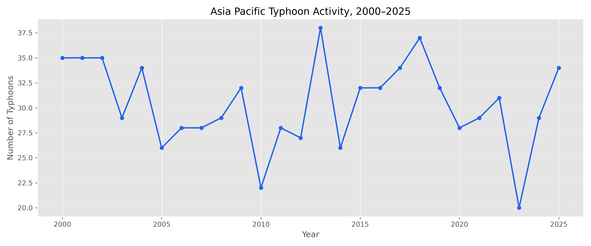
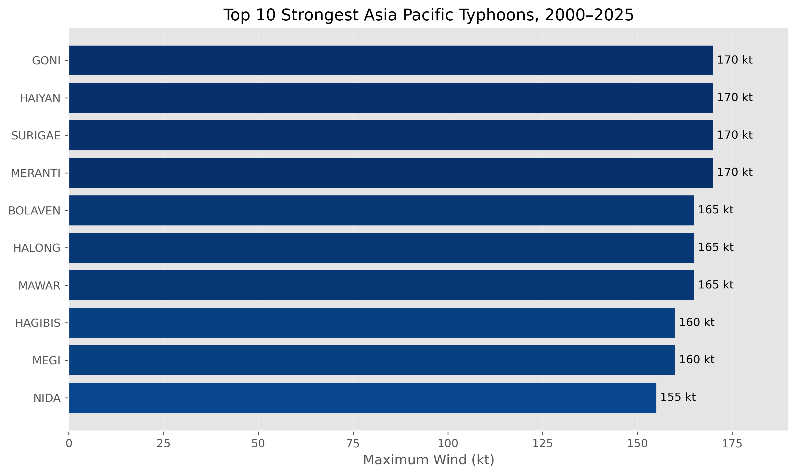

# Asia Pacific Typhoon Risk Analysis

An exploratory data analysis of tropical cyclone activity in the Asia Pacific using NOAA's IBTrACS dataset.

The project looks at where typhoons occur, how frequently they occur and how storm intensity has varied over time. The analysis is also designed as a small introduction to catastrophe risk analysis from an insurance perspective.

## 📊 Highlights

### Where do typhoons occur most often?

The geographical distribution shows clear concentrations of tropical cyclone activity across the Western Pacific particularly around Vietnam, the Philippines, Taiwan, southern China and Japan.

### How has typhoon activity changed?

The yearly trend shows the number of unique tropical cyclone systems recorded between 2000 and 2025.

### Which storms were the strongest?

The 10 strongest storms were identified based on their maximum sustained wind speed.

## Analysis

The project covers:

- Typhoon frequency by year
- Maximum storm intensity
- Distribution of typhoon intensity
- Geographical concentration of cyclone activity
- Recent typhoon tracks from 2020–2025

The analysis was performed using Python, pandas, matplotlib and Folium.

## Tools

- Python
- pandas
- matplotlib
- Folium
- GIS (Geographic Information System)

## Data

The analysis uses the **International Best Track Archive for Climate Stewardship (IBTrACS)** from NOAA's National Centers for Environmental Information.

Dataset: IBTrACS Version 4r01 — Western Pacific subset.

[NOAA IBTrACS](https://www.ncei.noaa.gov/products/international-best-track-archive)
